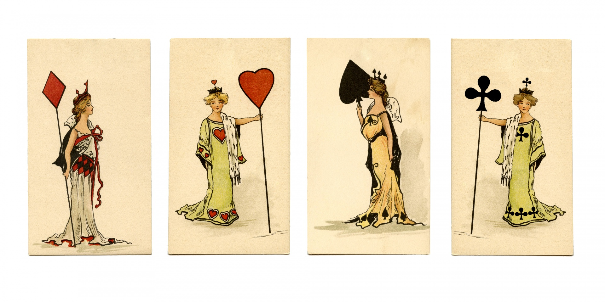

## [Resolução do Desafio Solteirona](<https://github.com/ermogenes/aulas-programacao-csharp/blob/master/exercises/classes-listas.md#exerc%C3%ADcio-solteirona>)

# Meu Projeto
O objetivo do meu programa é divertir as pessoas, o que deu origem a esse programa foi um desafio proposto pelo professor

**Fotos do programa em execução:**

## Instalação
1. Tenha o Windows como sistema operacional
1. Clique no [link](<https://github.com/ermogenes/aulas-programacao-csharp/blob/master/exercises/classes-listas.md#exerc%C3%ADcio-solteirona>) e baixe o programa
1. Abra o cmd e de dotnet Solteirona.dll ou procure o dll nas pastas e execute.

###### PS: Não precisa executar como administrar.

dotnet publish -c Release

