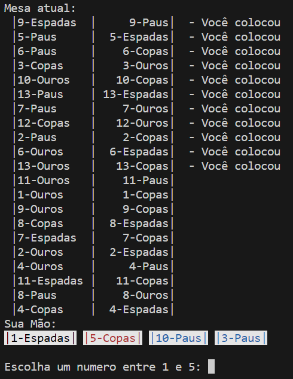

## [Resolução do Desafio Solteirona](<https://github.com/ermogenes/aulas-programacao-csharp/blob/master/exercises/classes-listas.md#exerc%C3%ADcio-solteirona>)

# Meu Projeto
O objetivo do meu programa é divertir as pessoas, o que deu origem a esse programa foi um desafio proposto pelo professor

**Fotos do programa em execução:** 

## Instalação
1. Tenha o Windows como sistema operacional
1. Clique no [link](<Release.rar>) e baixe o programa
    1. Abra o cmd e procure o dll nas pastas e de **dotnet 1I3-Solteirona-ProjetoF.dll**.
    1. Ou Clique no arquivo iniciar.

###### PS: Não precisa executar como administrar.

